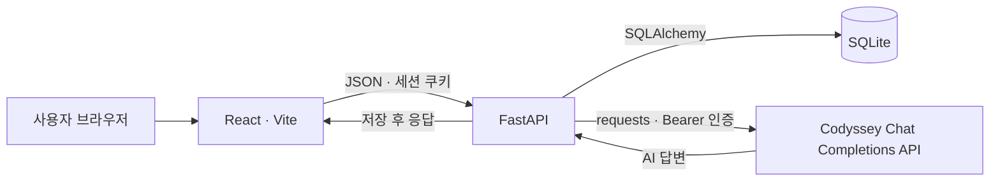
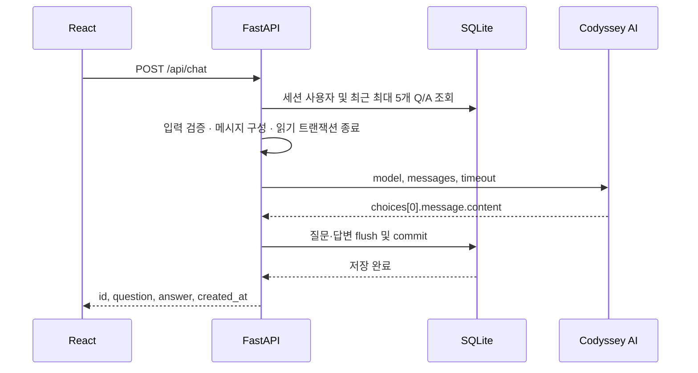

# 시스템 구조 및 처리 흐름

서버·프론트엔드 구성과 인증, 대화, 처방의 처리 흐름을 실제 코드 기준으로 설명합니다. 기준 코드는 `develop`의 `df73335`이며, 기록 조회 화면의 후속 변경은 아래에 별도로 구분합니다.

## 전체 시스템 구성

개발 중에는 Vite가 `/api`와 `/health`를 FastAPI에 프록시합니다. 배포 시에는 FastAPI가 Vite 빌드 결과인 `frontend/dist`도 제공하므로 하나의 공개 URL을 사용합니다.

| 구성 | 기술 | 주요 구현 |
| --- | --- | --- |
| 화면 | React, Vite, JavaScript, HTML/CSS | `frontend/src/App.jsx`, `scenes/`, `components/`, `hooks/` |
| API 요청 | fetch, REST, JSON | `frontend/src/services/api.js` |
| 서버 | Python, FastAPI, Uvicorn, Pydantic | `app/main.py`, `app/routers/`, `app/schemas/` |
| 데이터 | SQLite, SQLAlchemy 2.x 계열 ORM | `app/database.py`, `app/models.py`, `app/services/chats.py` |
| 인증 | Starlette SessionMiddleware, pwdlib Argon2 | `app/services/auth.py`, `app/dependencies.py` |
| AI | Codyssey OpenAI 호환 Chat Completions, requests | `app/services/ai.py`, `app/services/prompts.py` |
| 배포 | Railway, Railpack, Volume | `railway.json`, `railpack.json` |

`app/main.py`의 lifespan은 모델을 등록한 상태에서 `initialize_database(engine)`를 호출하고 종료 시 엔진을 해제합니다. API와 `/health`는 정적 파일 mount보다 먼저 등록되며 `/api/*`, `/health`는 SPA fallback 대상에서 제외됩니다.

## 회원가입·로그인·로그아웃

1. 회원가입은 사용자명을 정규화·검증하고 비밀번호 원문을 Argon2로 해시한 뒤 `users`에 저장합니다. 가입만으로 세션은 생성하지 않습니다.
2. 로그인은 사용자 조회와 해시 검증을 수행합니다. 성공하면 기존 세션을 비우고 `user_id`만 넣습니다.
3. 인증이 필요한 API는 `get_current_user()`를 사용합니다. 세션 값이 정확히 `int`인지 확인한 후 DB 사용자를 조회합니다. 문자열·bool·누락·존재하지 않는 사용자는 401입니다.
4. `/api/auth/me`는 `id`, `username`만 반환합니다. 프론트는 초기 로드 시 이 API로 로그인 상태를 복원합니다.
5. 로그아웃은 세션을 비웁니다. 로그인되지 않은 상태나 반복 요청에도 같은 성공 응답을 반환합니다.

세션 쿠키는 서명된 클라이언트 쿠키이며 비밀번호나 해시는 넣지 않습니다. 기본 수명은 14일이고 `HttpOnly`, `SameSite=lax`를 사용합니다. HTTPS 정책은 [환경 설정](DEPLOYMENT.md#환경-변수)을 참조합니다. 프론트의 요청에는 `credentials: 'include'`가 지정됩니다.

## 질문 → AI → DB → 응답

- `ChatRequest`는 `message`의 문자열 타입을 엄격히 검증하고 trim 후 1~2000자를 허용합니다.
- `get_recent_chats()`는 **인증된 사용자의** 최신 5개를 선택한 뒤 오래된 순서로 반환합니다. 전체 대화를 5개만 보관하는 구조가 아닙니다.
- `build_chat_messages()`는 시스템 메시지 뒤에 각 Q/A를 `user`, `assistant` 순으로 넣고 현재 질문을 마지막 `user`로 붙입니다.
- 최근 1시간의 대화 수와 질문 분량은 대화 단계 안내에 사용합니다. 문맥 데이터 자체는 최근 5개 Q/A이며 1시간으로 제한하지 않습니다.
- Q/A를 일반 메시지 데이터로 변환한 뒤 `db.rollback()`으로 읽기 트랜잭션을 끝냅니다. AI 대기 중에는 빈 Chat을 삽입하거나 쓰기 트랜잭션을 유지하지 않습니다.
- AI 답변의 줄바꿈과 연속 공백을 정리한 뒤 `save_chat()`에 전달합니다. commit 성공 후에만 성공 응답을 반환합니다.

AI 호출은 서버에서만 수행합니다. 키는 환경 변수에서 읽고 HTTP 요청에 `Authorization: Bearer ...`로 전달합니다. 외부 응답 형식·빈 응답·HTTP 실패와 timeout은 구분하여 처리합니다. 벡터 DB, RAG, 별도 장기 메모리는 사용하지 않습니다.

## 최종 처방

`POST /api/prescription`은 인증된 사용자의 최근 최대 5개 Q/A를 별도 처방 프롬프트에 전달합니다. 기록이 없으면 400입니다. AI 출력에서 `keyword`와 `message`를 검증하고 서버의 고정 매핑으로 `color`를 붙입니다. AI가 준 색상은 사용하지 않습니다.

처방 형식만 잘못되면 1회 재요청합니다. AI 전송 실패·timeout은 재시도하지 않습니다. 최종 결과는 `keyword`, `color`, `message`이며 DB에는 저장하지 않습니다. 처방 시점은 프론트의 버튼으로 결정하고 일반 대화 응답에 처방 시점 필드를 추가하지 않습니다. 색상 매핑은 [API 명세](API.md#post-apiprescription)를 참조합니다.

## 날짜별 대화 기록 조회

기준 develop에는 `list_user_chats()`와 읽기 전용 [기록 검증 도구](DATABASE.md)가 있습니다. `GET /api/me/chats`와 날짜 선택·기록 모달은 [Issue #58의 PR #59](https://github.com/peachily/codyssey1-termproject/pull/59)에 구현되어 있으나 문서 작성 시점에는 develop에 병합되지 않았습니다.

해당 PR은 세션 사용자 기준 전체 기록을 최신순으로 반환하고, 프론트에서 `Asia/Seoul` 날짜로 묶어 선택한 날짜의 대화를 오래된 순서로 표시합니다. 과거 기록은 읽기 전용이고 처방·물약 색상은 포함하지 않습니다. 처방에서 대화 화면으로 복귀하고 재질문하는 동작도 같은 PR의 변경입니다.

## 검증·오류·로그

입력 검증은 프론트와 서버 양쪽에서 수행하며 API 검증 실패는 `detail` 형식의 400으로 변환합니다. AI 실패는 502, timeout은 504, 대화 저장 실패는 rollback 후 500입니다. AI 실패 시 Chat을 저장하지 않습니다. 정확한 조건은 [API](API.md), 화면 안내와 운영 대응은 [DEPLOYMENT](DEPLOYMENT.md#오류-처리와-점검)를 참조합니다.

| 로그 이벤트 | 발생 위치·시점 |
| --- | --- |
| `request_received` | `app/main.py`: `/api/` 요청 수신, request_id·method·path |
| `ai_call_start` | `app/services/ai.py`: 외부 AI 요청 시작 |
| `ai_call_success` | 같은 파일: 사용할 수 있는 답변 수신, latency_ms |
| `ai_call_failure` | 같은 파일: timeout·호출·응답 형식 실패, reason |
| `db_save_success` | `app/services/auth.py`, `app/services/chats.py`: commit 성공 후 |
| `db_save_failure` | 같은 파일: 저장 실패·중복 사용자 처리 |
| `auth_lookup_failure` | 인증 사용자 조회 장애, request_id |

요청·AI 로그는 request_id로, 대화 저장 로그는 user_id·chat_id로 추적합니다. 질문·답변·비밀번호·API 키·세션 비밀값·내부 DB 오류 원문은 기록하지 않습니다.

## 관련 문서

[API 명세](API.md) · [DB 구조](DATABASE.md) · [실행 및 배포](DEPLOYMENT.md) · [검증](TESTING.md) · [개발 기준](DEVELOPMENT.md)
