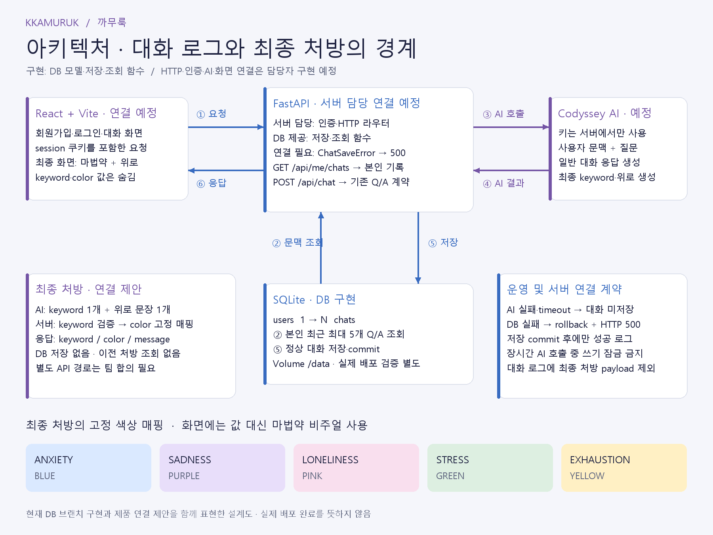

# 기술 및 시스템 구성

| 구성 | 기술 | 역할 |
| --- | --- | --- |
| 웹 화면 | React, Vite, JavaScript | 사용자 입력과 응답 표시 |
| 서버 | Python, FastAPI, Uvicorn, Pydantic | API 요청 처리 및 서버 측 AI 연동 |
| 데이터베이스 | SQLite, SQLAlchemy 2.x | 사용자와 일반 대화 Q/A 저장 |
| 인증 | SessionMiddleware, pwdlib[argon2] | 세션 쿠키 및 비밀번호 해시 |
| AI | Codyssey Chat Completions API, requests, gpt-5-mini | 대화 응답과 처방 메시지 생성 |
| 배포 | Railway | React 빌드와 FastAPI를 하나의 서비스 URL로 제공 |

## 아키텍처

<!-- TODO: 최종 아키텍처 이미지 교체 -->

## 대화 처리 설계

웹 화면에서 입력한 질문은 FastAPI 서버로 전달됩니다. 서버는 인증된 사용자의 최근 최대 5개 Q/A를 문맥으로 구성해 Codyssey API를 호출하고, 정상 응답을 받은 일반 대화 Q/A를 사용자 식별 정보·생성 시각과 함께 저장하는 구조입니다.

마법약 처방은 대화 내용을 바탕으로 상태와 위로 메시지를 생성하는 별도 결과이며, 일반 대화 기록과 달리 DB에 저장하지 않습니다.

<!-- TODO: 최종 인증·입력 검증·AI 예외 처리 및 로그 흐름 -->

## 관련 문서

- [API 명세](API.md)
- [DB 구조 및 저장 내용 확인](DATABASE.md)
- [실행·배포 및 환경 변수](DEPLOYMENT.md)
