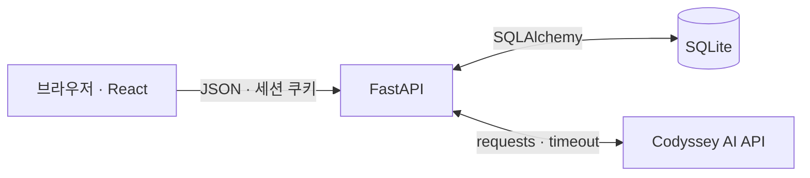
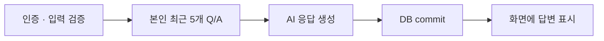

# 시스템 구조

서비스 구성과 주요 처리 흐름을 정리합니다.

## 전체 구성

| 구성 | 역할 | 주요 경로 |
| --- | --- | --- |
| React · Vite | 로그인·대화·처방·기록 화면 | `frontend/src/` |
| FastAPI | 인증·입력 검증·API·정적 파일 제공 | `app/main.py`, `app/routers/` |
| SQLite · SQLAlchemy | 사용자·대화 저장 | `app/models.py`, `app/services/chats.py` |
| SessionMiddleware · Argon2 | 세션 인증·비밀번호 해시 | `app/services/auth.py`, `app/dependencies.py` |
| Codyssey AI | 대화·처방 생성 | `app/services/ai.py`, `prompts.py` |
| Railway | FastAPI와 React 빌드를 하나의 URL로 제공 | `railway.json`, `railpack.json` |

## 질문 처리

- 문맥: 최근 5개 Q/A를 시간순으로 구성하고 현재 질문을 추가.
- 저장: 전체 대화 누적 저장. AI 실패 시 미저장, DB 실패 시 rollback.
- AI 키: 서버 환경 변수에서만 사용.

## 주요 동작

| 기능 | 처리 |
| --- | --- |
| 회원가입 | 입력 검증 → Argon2 해시 저장 → 별도 로그인 |
| 로그인·로그아웃 | 로그인 시 세션 교체, 로그아웃 시 세션 제거 |
| 접근 제어 | 세션의 사용자 ID로 DB 조회. 미인증은 401 |
| 처방 | 최근 5개 Q/A → keyword 검증 → 고정 색상 매핑. DB 저장 안 함 |
| 이야기로 돌아가기 | 로그인·현재 답변·작성 중 입력 유지, 재질문 가능 |
| 지난 이야기 | 나가기 왼쪽 달력 → 날짜 선택 → 읽기 전용 말풍선 |
| 날짜·시간 | DB·API는 UTC, 화면은 한국 시간 |
| 모바일 | 가변 화면 높이·안전 영역·모달 내부 스크롤 적용 |

## 검증·오류·로그

| 이벤트 | 기록 위치 |
| --- | --- |
| `request_received` | `app/main.py` |
| `ai_call_start`, `ai_call_success`, `ai_call_failure` | `app/services/ai.py` |
| `db_save_success`, `db_save_failure` | `app/services/auth.py`, `chats.py` |
| `db_read_failure` | `app/routers/history.py` |
| `auth_lookup_failure` | `app/services/auth.py`, `app/dependencies.py` |

- 추적: request_id·user_id·chat_id. 비밀값과 대화 원문은 로그에서 제외.
- 오류: 입력 400, 인증 401, DB 500, AI 실패 502, timeout 504.
- 세부 근거: [API](API.md) · [DB](DATABASE.md) · [테스트](TESTING.md)
