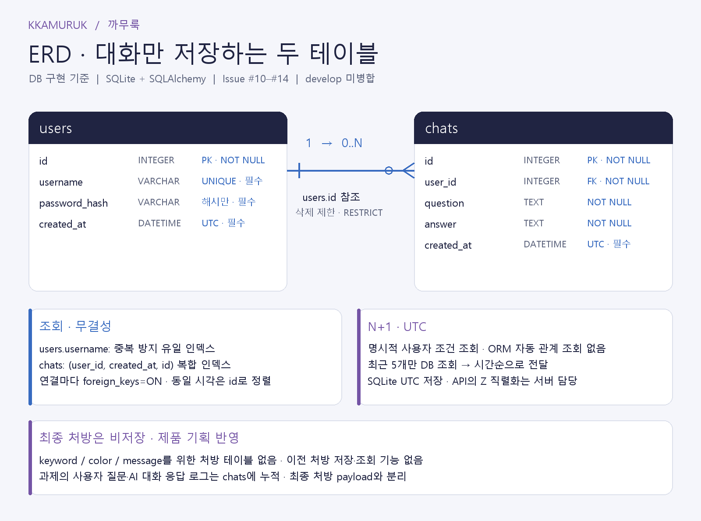

# 데이터베이스 구조 및 확인 방법

## ERD



<!-- TODO: 최종 ERD 이미지 교체 -->

## 테이블 관계

`users.id` (1) → `chats.user_id` (N)

SQLite에 사용자와 일반 대화 Q/A를 저장합니다. 각 대화는 한 사용자에 속하며 최종 마법약 처방은 저장 대상이 아닙니다.

## users

| 필드 | SQLite 선언 타입 | 제약조건·의미 |
| --- | --- | --- |
| id | INTEGER | 기본키, 필수, DB에서 식별자 생성 |
| username | VARCHAR | 필수, UNIQUE |
| password_hash | VARCHAR | 필수, 비밀번호 해시 |
| created_at | DATETIME | 필수, ORM 삽입 시 UTC 현재 시각 기본값 |

## chats

| 필드 | SQLite 선언 타입 | 제약조건·의미 |
| --- | --- | --- |
| id | INTEGER | 기본키, 필수, DB에서 식별자 생성 |
| user_id | INTEGER | 필수, users.id 외래키, ON DELETE RESTRICT |
| question | TEXT | 필수, 검증 완료된 사용자 질문 |
| answer | TEXT | 필수, 정상적으로 수신한 AI 응답 |
| created_at | DATETIME | 필수, ORM 삽입 시 UTC 현재 시각 기본값 |

## 저장 및 조회

생성 시각은 UTC로 저장합니다. 사용자 이름은 중복될 수 없으며 대화의 사용자 ID에는 외래키 제약을 적용합니다. 대화가 남아 있는 사용자의 삭제는 제한됩니다.

대화 조회에는 `(user_id, created_at, id)` 복합 인덱스를 사용합니다. 전체 기록은 최신순으로, 문맥용 최근 최대 5개 Q/A는 시간순으로 반환합니다. 저장 실패 시 트랜잭션을 rollback하고 성공·실패 이벤트를 로그로 남깁니다.

## DB 저장 내용 확인

읽기 전용 확인 도구로 사용자별 질문·응답·생성 시각을 조회합니다. 사용자 ID를 지정하며 기본 조회 건수는 최근 20개입니다. 비밀번호 해시는 출력하지 않습니다.

```sh
python scripts/check_db.py --database ./chatbot.db --user-id 1
```

Railway Volume의 DB 파일에 접근할 수 있는 환경에서는 다음 명령을 사용합니다.

```sh
python scripts/check_db.py --database /data/chatbot.db --user-id 1
```

[확인용 SQL](../scripts/check_logs.sql)로 테이블 구조와 사용자별 대화, 최근 대화 조회 계획을 확인할 수도 있습니다.

<!-- TODO: 테스트 계정 DB 조회 결과 증빙 -->
