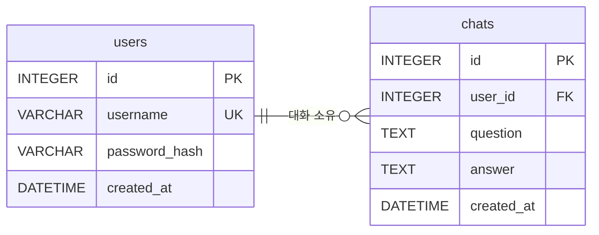

# 데이터베이스 구조 및 기록 검증

사용자·대화 저장 구조와 읽기 전용 확인 방법을 정리합니다.

## ERD



## 테이블과 제약조건

| 항목 | 기준 |
| --- | --- |
| 전체 컬럼 | NOT NULL |
| users.id / chats.id | 자동 생성 PK |
| users.username | UNIQUE |
| users.password_hash | Argon2 해시. 평문 미저장 |
| chats.user_id | FK → users.id, 삭제 RESTRICT |
| chats.question / answer | 검증된 질문·정상 AI 답변 |
| created_at | UTC 저장, API는 `Z`, 화면은 Asia/Seoul |
| 복합 인덱스 | `ix_chats_user_created_id (user_id, created_at, id)` |
| SQLite 연결 | foreign_keys ON, busy_timeout 5000ms |
| 처방·물약 색상 | 저장하지 않음 |

구현: `app/models.py`, `app/database.py`, `app/services/chats.py`.

## 저장·조회 순서

| 함수 | 동작 |
| --- | --- |
| `save_chat` | flush → commit → 성공 로그. 실패 시 rollback·ChatSaveError |
| `list_user_chats` | 본인 전체 기록, 최신순 |
| `get_recent_chats` | 본인 최신 5개 선택 → 시간순 반환 |

- 전체 대화는 누적 저장. 최근 5개 제한은 AI 문맥에만 적용.
- 시각 동률은 id로 정렬. AI 호출 전 읽기 트랜잭션 종료.

## 사용자별 기록 조회 SQL

**준비:** 테스트 계정으로 가입·대화 후, 저장소 루트에서 실행합니다. SQLite CLI가 필요합니다.

```sh
sqlite3 -readonly ./chatbot.db
```

- DB 경로: 로컬 기본 `./chatbot.db`, Railway Volume `/data/chatbot.db`.
- 아래 `sample_user`와 `user_id = 1`은 테스트 계정의 실제 값으로 변경.

```sql
-- 사용자 ID 확인
SELECT id, username FROM users WHERE username = 'sample_user';

-- 본인 최근 20개 기록과 한국 시간
SELECT id, user_id, question, answer, created_at AS utc,
       datetime(created_at, '+9 hours') AS kst
FROM chats WHERE user_id = 1
ORDER BY created_at DESC, id DESC LIMIT 20;

-- 사용자별 대화 건수 (기록이 없으면 0)
SELECT u.id AS user_id, COUNT(c.id) AS chat_count
FROM users u LEFT JOIN chats c ON c.user_id = u.id
GROUP BY u.id ORDER BY u.id;

-- 한국 날짜별 건수
SELECT date(created_at, '+9 hours') AS date_kst, COUNT(*) AS chat_count
FROM chats WHERE user_id = 1
GROUP BY date_kst ORDER BY date_kst DESC;
```

**확인:** 사용자별 분리, 질문·답변·시각, 최신순 정렬. 종료는 `.quit`.

## 기존 검증 도구

저장소 루트에서 실행합니다. Python 도구는 표준 라이브러리만 사용하며 DB를 읽기 전용으로 엽니다.

```sh
python scripts/check_db.py --database ./chatbot.db --user-id 1 --limit 20
sqlite3 -readonly ./chatbot.db ".read scripts/check_logs.sql"
```

| 도구 | 인자·확인 결과 |
| --- | --- |
| `check_db.py` | database·user-id 필수, limit 기본 20. JSON 기록 반환, 없으면 `[]` |
| `check_logs.sql` | 스키마·인덱스·사용자 1 기록·쿼리 계획. 다른 사용자는 파일의 두 `user_id = 1` 변경 |

## 오류 점검

| 증상 | 확인 |
| --- | --- |
| 파일 열기 실패 | DB 경로·읽기 권한 |
| no such table | 서버 초기화 여부·다른 DB 파일 여부 |
| 빈 결과 | 사용자 ID·정상 대화 저장 여부 |
| 인자 오류 | user-id·limit 양수 여부 |

검증: 별도 테스트 DB에서 사용자 2명·대화 3개 생성 → 본인 기록 2개·최신순·인덱스 사용 확인. [자동화 테스트](TESTING.md)에서도 검증합니다.
