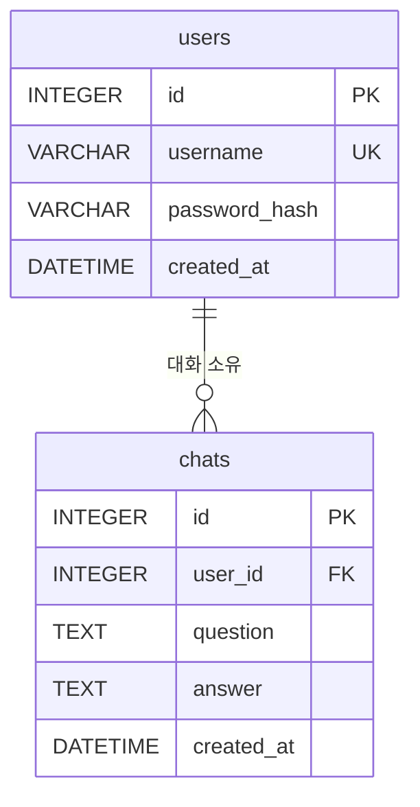

# 데이터베이스 구조 및 기록 검증

실제 테이블·제약조건과 사용자별 대화 기록을 읽기 전용으로 조회하는 방법을 설명합니다. 모델은 `app/models.py`, 연결은 `app/database.py`, 저장·조회 함수는 `app/services/chats.py`에 있습니다.

## ERD



## 테이블과 제약조건

| 테이블 | 컬럼 | SQLite 선언 타입 | 제약·의미 |
| --- | --- | --- | --- |
| users | id | INTEGER | PK, NOT NULL, 식별자 자동 생성 |
| users | username | VARCHAR | UNIQUE, NOT NULL |
| users | password_hash | VARCHAR | NOT NULL, Argon2 해시 |
| users | created_at | DATETIME | NOT NULL, 가입 시각 |
| chats | id | INTEGER | PK, NOT NULL, 식별자 자동 생성 |
| chats | user_id | INTEGER | NOT NULL, FK → users.id, ON DELETE RESTRICT |
| chats | question | TEXT | NOT NULL, trim·검증된 사용자 질문 |
| chats | answer | TEXT | NOT NULL, 정상 AI 답변 |
| chats | created_at | DATETIME | NOT NULL, 저장 시각 |

`chats`에는 `(user_id, created_at, id)` 복합 인덱스 `ix_chats_user_created_id`가 있습니다. 연결 시 `PRAGMA foreign_keys=ON`, `PRAGMA busy_timeout=5000`을 적용합니다. 대화가 남아 있는 사용자 삭제는 제한하며 cascade는 없습니다. 평문 비밀번호와 최종 처방의 keyword·color·message는 저장하지 않습니다.

## 저장·조회 순서

| 함수 | 처리 |
| --- | --- |
| `save_chat(db, user_id, question, answer)` | Chat 생성 → add → flush → commit → 성공 로그 → Chat 반환 |
| `list_user_chats(db, user_id)` | 해당 사용자 전체 기록을 `created_at DESC, id DESC`로 반환 |
| `get_recent_chats(db, user_id)` | 같은 정렬로 최신 최대 5개 선택 후 역순으로 반환 |

전체 대화는 누적 저장하고 **문맥으로 사용할 때만** 5개로 제한합니다. 사용자 ID는 API의 인증된 사용자에게서 얻습니다. AI 요청 전에 최근 Q/A를 메시지 데이터로 복사하고 읽기 트랜잭션을 rollback하여 종료합니다. 저장 실패는 rollback·실패 로그 후 `ChatSaveError`로 전달하며 API가 500으로 변환합니다.

`SessionLocal`은 `expire_on_commit=False`입니다. SQLAlchemy 관계 지연 로딩 대신 명시적 SELECT를 사용합니다. 저장 함수는 전달받은 세션 전체를 commit하므로 무관한 미저장 변경을 같은 세션에 넣지 않습니다.

## UTC 저장과 한국 시간 표시

`UTCDateTime`은 시간대가 있는 datetime만 받아 UTC로 바꾸고 SQLite에는 시간대 표기 없는 UTC 값을 저장합니다. 읽을 때 UTC tzinfo를 복원하며 API 응답은 `Z`로 끝납니다. 생성 시각 기본값은 ORM의 `datetime.now(timezone.utc)`입니다. 직접 SQL 삽입에는 이 기본값이 적용되지 않습니다.

예를 들어 DB의 `2026-10-07 15:00:00`은 한국 시간 `2026-10-08 00:00:00`입니다. SQL 검증은 고정 `+9 hours`를 사용하며 서버의 localtime에 의존하지 않습니다. `Asia/Seoul`로 묶는 프론트 날짜별 기록 화면은 [PR #59](https://github.com/peachily/codyssey1-termproject/pull/59)의 병합 전 변경입니다.

## 사전 준비

아래 명령은 모두 **저장소 루트**에서 실행합니다.

1. [실행 안내](DEPLOYMENT.md)에 따라 서버를 시작합니다. 시작 시 모델 등록 후 `create_all()`로 없는 테이블을 생성합니다. 기존 스키마를 변경하는 마이그레이션은 수행하지 않습니다.
2. 웹에서 테스트 계정으로 가입·로그인하고 질문에 대한 정상 답변을 한 번 이상 받습니다.
3. 해당 환경의 DB 파일을 확인합니다. 기본 로컬 경로는 `./chatbot.db`, Railway Volume 기준은 `/data/chatbot.db`입니다. `DATABASE_URL`을 변경했다면 아래 파일 경로도 바꿉니다.
4. 테스트 계정 ID는 가입·로그인 응답의 `id`, `/api/auth/me`, 또는 아래 SQL로 확인합니다. 비밀번호·해시는 조회하지 않습니다.

SQLite CLI를 사용할 경우:

```sh
sqlite3 -readonly ./chatbot.db
```

열린 SQLite 프롬프트에서 실행:

```sql
.headers on
.mode column
SELECT id, username FROM users WHERE username = 'sample_user';
```

`sample_user`를 본인이 만든 테스트 계정명으로 바꿉니다. 아래 예시의 `user_id = 1`은 이 조회 결과로 바꿉니다. 관리 목적의 로컬 SQL은 DB 파일 접근 권한이 있는 환경에서만 사용하며 공개 API에 임의 사용자 ID 조회 기능을 제공하지 않습니다.

## 사용자별 기록 조회 SQL

위에서 연 **읽기 전용 SQLite 프롬프트**에서 실행합니다.

```sql
SELECT id, user_id, question, answer, created_at AS created_at_utc,
       datetime(created_at, '+9 hours') AS created_at_kst
FROM chats
WHERE user_id = 1
ORDER BY created_at DESC, id DESC
LIMIT 20;
```

확인 방법:

- `user_id`가 지정한 값만 포함되는지 확인합니다.
- 질문·답변·시각이 같은 행에 있고 최신 기록이 먼저 나오는지 확인합니다.
- 다른 테스트 계정 ID로 다시 조회하여 사용자 데이터가 섞이지 않는지 확인합니다.
- `LIMIT 20`은 검증용 출력 제한입니다. DB가 최근 20개만 저장한다는 뜻은 아닙니다.

사용자별 대화 건수:

```sql
SELECT u.id AS user_id, COUNT(c.id) AS chat_count
FROM users AS u
LEFT JOIN chats AS c ON c.user_id = u.id
GROUP BY u.id
ORDER BY u.id;
```

기록이 없는 사용자는 0으로 표시됩니다. 특정 사용자의 한국 날짜별 건수:

```sql
SELECT date(created_at, '+9 hours') AS date_kst, COUNT(*) AS chat_count
FROM chats
WHERE user_id = 1
GROUP BY date(created_at, '+9 hours')
ORDER BY date_kst DESC;
```

검증 종료는 `.quit`입니다. 위 SQL은 SELECT만 수행하고 레코드를 수정하거나 삭제하지 않습니다.

## 기존 Python 검증 도구

사전 준비: Python이 설치되어 있고 DB 파일에 읽기 권한이 있어야 합니다. 이 도구는 표준 라이브러리만 사용하며 서버 실행이나 AI 키는 필요하지 않습니다.

**저장소 루트**에서:

```sh
python scripts/check_db.py --database ./chatbot.db --user-id 1 --limit 20
```

- `--database`: 실제 SQLite 파일 경로, 필수
- `--user-id`: 검증할 양의 사용자 ID, 필수
- `--limit`: 양의 조회 건수, 기본 20
- 내부적으로 `mode=ro`로 열어 파일 생성·수정을 막습니다.

가상 예시 출력:

```json
[
  {"id": 2, "user_id": 1, "question": "질문", "answer": "답변", "created_at": "2026-10-07 15:00:00.000000"}
]
```

실제 도구는 `ensure_ascii=True`로 출력하므로 한글이 `\uXXXX`로 보일 수 있습니다. 같은 JSON 문자열이며 오류가 아닙니다. 기록이 없으면 `[]`입니다. 반환 시각은 DB 원본 UTC 값이며 이 스크립트는 KST 변환을 하지 않습니다.

Railway의 `/data`에 실제로 접근 가능한 환경에서는 **저장소 루트**에서 경로만 바꿉니다.

```sh
python scripts/check_db.py --database /data/chatbot.db --user-id 1 --limit 20
```

## 기존 SQL 파일 실행

[scripts/check_logs.sql](../scripts/check_logs.sql)은 테이블 컬럼, 외래키, 인덱스, 사용자 1의 최신 20개 대화와 최신 5개 쿼리의 실행 계획을 조회합니다. 파일을 그대로 실행할 때는 **테스트 계정 ID가 1인지** 먼저 확인합니다. 다른 ID를 쓰려면 앞 절의 SQL을 직접 실행하거나 파일의 두 `WHERE user_id = 1`을 자신의 ID로 바꿉니다.

macOS/Linux, **저장소 루트**:

```sh
sqlite3 -readonly ./chatbot.db < scripts/check_logs.sql
```

PowerShell, **저장소 루트**:

```powershell
sqlite3 -readonly ./chatbot.db ".read scripts/check_logs.sql"
```

예상 확인: users·chats의 컬럼 및 제약 정보, 해당 사용자의 기록, 실행 계획의 `ix_chats_user_created_id` 사용. ORM으로 접속할 때 적용하는 PRAGMA 설정과 별개로, 검증 CLI는 읽기만 수행합니다.

## 오류 점검 및 검증 근거

| 상황 | 점검 |
| --- | --- |
| DB 파일 열기 실패 | 실행 위치, DATABASE_URL의 실제 파일 경로, 파일·상위 경로 읽기 권한 |
| `no such table` | 다른 DB 파일을 열었는지, 서버 초기화를 했는지 |
| 결과가 비어 있음 | 사용자 ID, AI·DB 저장 성공 여부, 조회 대상 환경 |
| 인자 오류 | `--user-id`, `--limit`가 양수인지 |
| 한국 날짜가 하루 다름 | UTC 원본과 `+9 hours` 적용 여부 |

2026-10-08 별도 테스트 DB에 사용자 2명과 대화 3개를 넣어 기존 스크립트·SQL을 실행했습니다. 사용자 1의 2개 대화가 최신순으로 출력되고 복합 인덱스를 사용하는 것을 확인했습니다. 실제 운영 데이터나 로그인 정보를 증빙에 포함하지 않았습니다. 자동화 검증은 `tests/test_database.py`, `test_models.py`, `test_chat_service.py`, `test_check_db.py`에서 확인할 수 있습니다.
