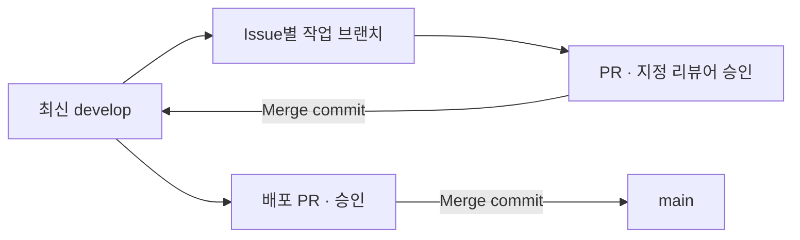

# 개발 규칙

구현 경계와 팀 협업 규칙을 정리합니다.

## 작업 원칙

- 요청 범위에서 작업. 다른 담당 영역·공통 계약 변경은 먼저 조율.
- 불필요한 기능·파일·대규모 구조 변경 금지.
- 백엔드 의존성은 `requirements.txt`, 프론트는 package.json·lock 파일 함께 갱신.
- 비밀값은 환경 변수로 관리. 코드·문서·로그·Git 기록에 포함하지 않음.

## 담당 영역과 변경 원칙

| 영역 | 주요 경로 |
| --- | --- |
| 인증 | `app/routers/auth.py`, `app/services/auth.py`, `app/dependencies.py` |
| DB·기록 | `app/database.py`, `app/models.py`, `app/services/chats.py`, `app/routers/history.py` |
| AI·대화·처방 | `app/services/ai.py`, `prompts.py`, `app/routers/chat.py` |
| 웹 UI·API 연결 | `frontend/` |

담당자는 입력 검증·예외·로그·테스트까지 함께 구현합니다. 개인별 작업은 [TEAM](TEAM.md)에 정리합니다.

## 기술 계약

| 영역 | 유지할 기준 |
| --- | --- |
| 프론트 | React·Vite·JavaScript·fetch. Next.js·Axios·별도 전역 상태관리 미사용 |
| 서버 | FastAPI·Pydantic·Uvicorn. API를 정적 mount보다 먼저 등록, `/health` 유지 |
| 인증 | Argon2·SessionMiddleware, JWT 미사용. 세션에 user_id만 저장 |
| 권한 | 서버에서 정확한 int ID·DB 사용자 확인. 클라이언트 user_id로 조회 대상 변경 금지 |
| 통신 | JSON·credentials include. Vite는 `/api`, `/health` 프록시 |
| 입력·응답 | [API 명세](API.md) 준수. password 원문 유지, 임의 제한·error wrapper 추가 금지 |
| AI | 서버 requests로만 호출, Bearer 키·model·messages·timeout 지정 |
| 문맥 | 본인 최근 5개 Q/A를 시간순 전달. RAG·벡터 DB 미사용 |
| 처방 | keyword 검증·고정 색상. Chat.answer 우회 저장·처방 컬럼 추가 금지 |
| 오류 | AI 실패 502·timeout 504·미저장. DB 저장 실패 500·rollback |
| 배포 | main → Railway, FastAPI가 React dist 제공, DB는 `/data` Volume |

## DB 연동

- 요청별 `Depends(get_db)` 사용. 직접 세션이 필요하면 `SessionLocal` 사용.
- 시작: 모델 등록·initialize_database. 종료: engine.dispose. 스키마 변경은 별도 백업·마이그레이션.
- 저장·조회 user_id는 인증된 user.id. 저장 함수는 세션 전체를 commit하므로 무관한 미저장 변경 금지.
- AI 호출 전 Q/A를 일반 데이터로 변환하고 rollback으로 읽기 트랜잭션 종료. 빈 Chat 선삽입 금지.
- commit 후 성공 로그·응답. 저장 오류는 rollback·실패 로그·ChatSaveError → 500, 사용자명 중복은 409.
- 유지: expire_on_commit=False, FK 검사, 5초 busy_timeout, 복합 인덱스, 명시적 SELECT.
- UTCDateTime은 시간대 있는 입력만 허용. 직접 SQL 삽입 시 생성 시각 명시.
- cascade·불필요한 relationship/인덱스·WAL·별도 DB 서버 임의 추가 금지.
- 구조·조회 순서·SQL: [DATABASE](DATABASE.md).

## 검증·보안

- 인증·AI·DB 실패와 복구를 함께 테스트. 운영 데이터 대신 테스트 계정·임시 DB 사용.
- 서비스에 인증 우회용 테스트 로그인 API 추가 금지.
- 로그는 추적 ID 중심. 질문·답변·비밀번호·키·내부 DB 오류 원문 제외.
- 새 설정은 `.env.example`에도 반영. VITE_ 변수에 비밀값 금지.
- 자동화·실제 AI·브라우저·배포 검증을 구분해 기록.
- 실행·설정: [DEPLOYMENT](DEPLOYMENT.md), 테스트: [TESTING](TESTING.md).

## Git 작업 흐름

| 항목 | 규칙 |
| --- | --- |
| Issue | 목적·요구사항·범위·완료 조건·의존성 기록 |
| 브랜치 | `<type>/<issue_number>-<module>-<task_name>` |
| 예시 | `feature/58-ui-chat_history`, `docs/60-docs-final_documentation` |
| 이름 | 실제 Issue 번호, 영문 소문자, 단어 구분 underscore |
| 브랜치 type | feature / fix / chore / docs / misc |
| 작업 위치 | 최신 develop에서 분기, 작업별 worktree |
| 연결 | Issue Development에서 기준·브랜치·PR 연결 확인 |
| 커밋·PR 제목 | `<type>: <한글 설명>`, 의미 있는 작업 단위 |
| 커밋 type | feat / fix / docs / refactor / test / chore / misc |
| PR 본문 | [템플릿](../.github/pull_request_template.md), 실제 변경·검증·관련 Issue |
| PR 생성 | 현재 브랜치·변경·push 상태 확인, CLI 가능 시 gh pr create |
| 리뷰 | GitHub Reviewer에 실제 지정. 불가 시 임의 대체하지 않고 알림 |
| 병합 | 지정 리뷰어 Approve 후 Merge commit. Squash·Rebase 금지 |
| 직접 반영 | main·develop에 기능 직접 push 금지, main은 develop 통합 PR 사용 |

- Issue의 Development → Create a branch에서 기본 main 대신 최신 develop 선택 후 fetch.
- 원격 반영 미승인 작업은 로컬에서 준비. 브랜치 이름만으로 Issue 자동 연결되지 않음.
- develop 대상 `Closes #번호`는 자동 종료를 기대하지 않고 완료 상태 별도 관리.
- 개인별 유의미한 커밋 최소 10회. Issue 기록은 커밋·PR 이력을 대체하지 않음.

| PR 작성자 | 지정 리뷰어 |
| --- | --- |
| peachily | b0e2 |
| b0e2 · jungmyung16 · TraceofLight | peachily |

## 문서 기준

| 문서 | 역할 |
| --- | --- |
| [README](../README.md) | 서비스 소개·이용 흐름·필수 환경 설정·문서 링크 |
| [ARCHITECTURE](ARCHITECTURE.md) | 시스템 구성·처리 흐름 |
| [API](API.md) | 요청·응답·검증·오류 계약 |
| [DATABASE](DATABASE.md) | DB 설계·사용자별 확인 SQL |
| [DEPLOYMENT](DEPLOYMENT.md) | 설치·설정·배포·운영 |
| [TESTING](TESTING.md) | 과제 요구사항별 검증 근거·확인 방법 |
| [TEAM](TEAM.md) | 팀 역할·작업 내역·관련 PR |
| 이 문서 | 작업 경계·기술 계약·협업 규칙 |

- 실제 구현·검증 근거만 작성. 반복 설명은 링크로 대체.
